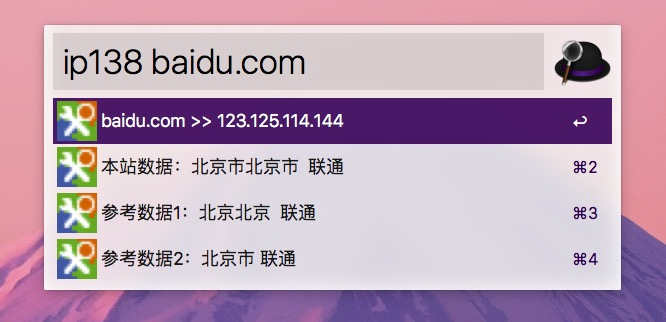

# 为什么要做这个workflow
之前网上找的ip138 workflow查询域名时不显示相应的ip，想获取ip还得到网页查看或使用其他工具。  
本工具包含了查询域名时返回的ip地址  

# 用法
如上图所示，`ip138 <domain>`即可查询。`ipclear`清除缓存

# 用到的库
[Alfred-workflow](https://github.com/deanishe/alfred-workflow/) python开发workflow的辅助库，极力推荐  
[BeautifulSoup4](https://www.crummy.com/software/BeautifulSoup/) 用优雅地方式读取网页中的数据，告别大量的正则匹配

以上库文件已包含在项目中，无需单独安装